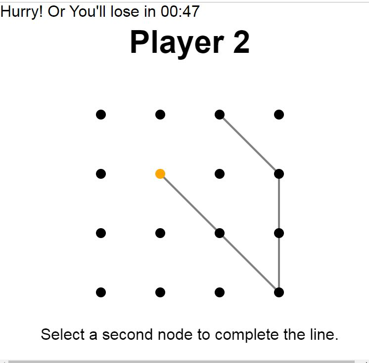
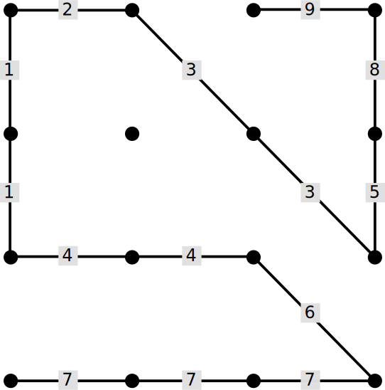

# thedotgame
​
## Table of Contents
* [Live App](#live-app)
* [About](#about)
* [Rules](#rules)
* [Example Game](#example-game)
* [Setup](#setup)
​
## Live App:
Play Game now at: [https://nicholas-schaefer.github.io/holdtheline/]

## About:
A connect-the-dots game for two players, created by Sid Sackson. 
Move CountDown Timer added for added urgency!

​
## Rules:
* The game is played on a 4x4 grid of 16 nodes.
* Players take turns drawing octilinear lines connecting nodes. (lines that are either horizontal, vertical, or at 45° angles)
* Each line must begin at the start or end of the existing path, so that all lines form a continuous path.
* The first line may begin on any node.
* A line may connect any number of nodes.
* Lines may not intersect.
* No node can be visited twice.
* The game ends when no valid lines can be drawn.
* The player who draws the last line is the loser.

## Example Game:
Each move is numbered. Lines that connect more that two nodes have each segment numbered. Player 1 made the odd numbered moves and Player 2 made the even numbered moves. Player 1 made the first move (1) and was forced to make the last move (9). Thus, Player 2 won.

​
## Setup
Steps to run app on local server
- git clone the repo
- open index.html in Chrome or your web browser of choice!
